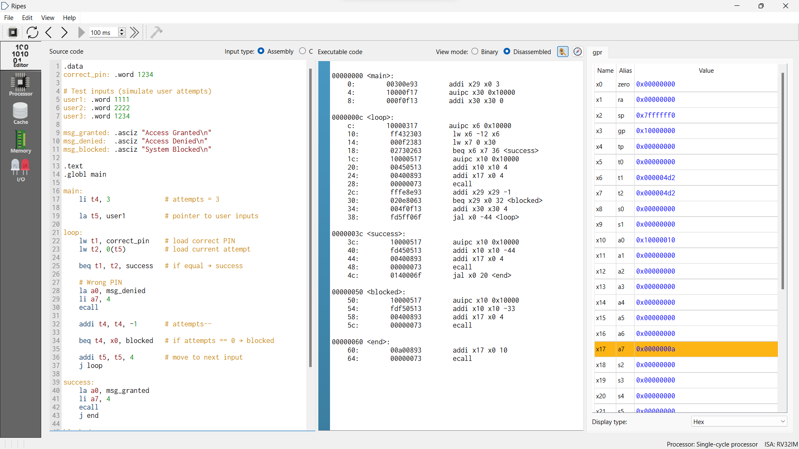
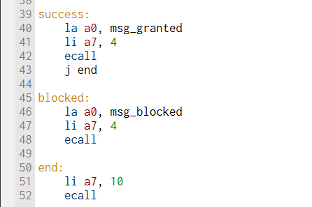
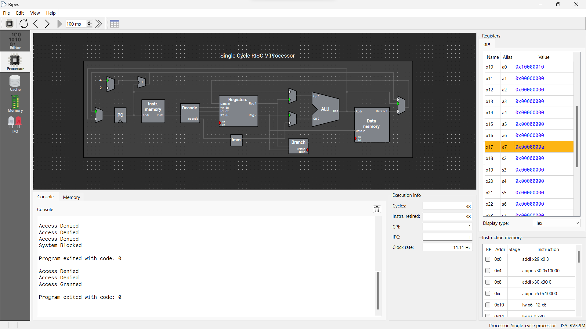
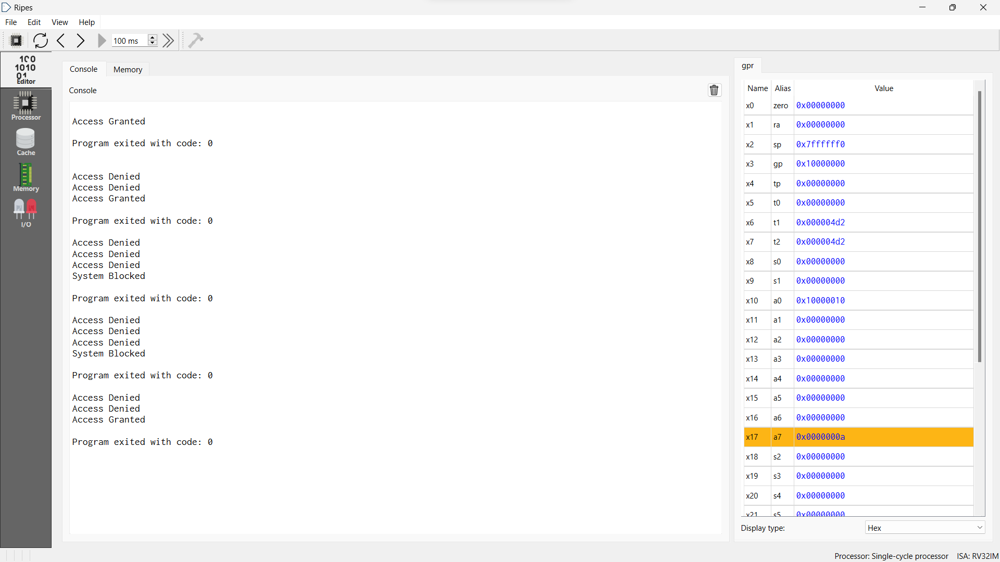

# 🔐 Password / PIN Verification System (Ripes)

## 📌 Project Overview
This project implements a **Password/PIN Verification System** using **RISC-V Assembly Language** in the **Ripes Simulator**. It simulates how a processor authenticates a user by comparing entered credentials with stored values.

---

## 🎯 Objectives
- To understand **RISC-V instruction execution**
- To implement **branching and comparison logic**
- To simulate a real-world **authentication system**
- To visualize processor operations in **Ripes**

---

## ⚙️ Features
✔ PIN verification  
✔ Access Granted / Denied  
✔ 3-attempt login system  
✔ System block after failed attempts  
✔ Loop and branching implementation  

---

## 🛠️ Tools & Technologies
- Ripes Simulator  
- RISC-V (RV32I Architecture)  
- Assembly Language  

---

## 🧠 Working Principle

1. Store the correct PIN in memory  
2. Take user input (simulated in memory)  
3. Compare using `beq` instruction  
4. If equal → Access Granted  
5. If not → Reduce attempts  
6. After 3 failures → System Blocked  

---

## 🔄 Flowchart

## 💻 Sample Output
Access Denied
Access Denied
Access Granted

---

## 📸 Screenshots
### 💻 Code in Ripes

### 💻 Processor in Ripes

### ▶️ Output

---

## 📚 Conclusion
This project demonstrates how basic processor instructions like **load, compare, branch, and loop** can be used to implement a real-world authentication system using RISC-V architecture.

---

## 🚀 Future Enhancements
- Real-time user input
- Password encryption
- Hardware implementation (FPGA)
